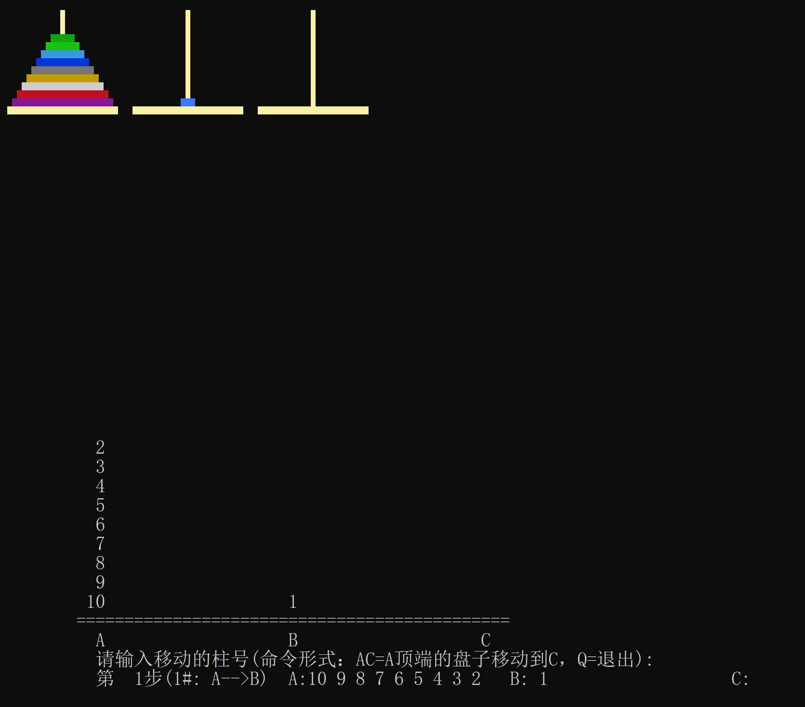

# 汉诺塔控制台程序 | C++ 课程项目

## 🎮 项目简介
这是一个基于 C++ 开发的汉诺塔交互控制台程序，作为课程大作业完成。
项目实现了汉诺塔问题的递归求解、多解路径可视化、自定义交互菜单等功能，锻炼了基础算法实现、控制台交互与结构化编程能力。

## 🛠️ 运行环境
- 开发工具：Visual Studio 2022
- 语言标准：C++11 及以上
- 运行依赖：Windows 系统控制台（自带API，无需额外安装依赖）

## 🚀 编译运行步骤
1.  **下载代码**：将本仓库代码下载/克隆到本地
2.  **打开项目**：使用 Visual Studio 2022 打开 `90-b1.vcxproj` 项目文件
3.  **编译生成**：点击菜单栏「生成」→「生成解决方案」
4.  **运行程序**：编译完成后，直接点击「本地Windows调试器」运行即可启动交互界面

## ✨ 核心功能亮点
- 实现了汉诺塔问题的递归算法，支持自定义盘子数量求解
- 支持多解路径的可视化展示，可查看完整移动步骤
- 设计了交互菜单系统，支持用户自定义操作与参数设置
- 封装了控制台绘图工具，实现了简单的动画与界面渲染
- 完整的步数统计与状态反馈，优化用户交互体验

